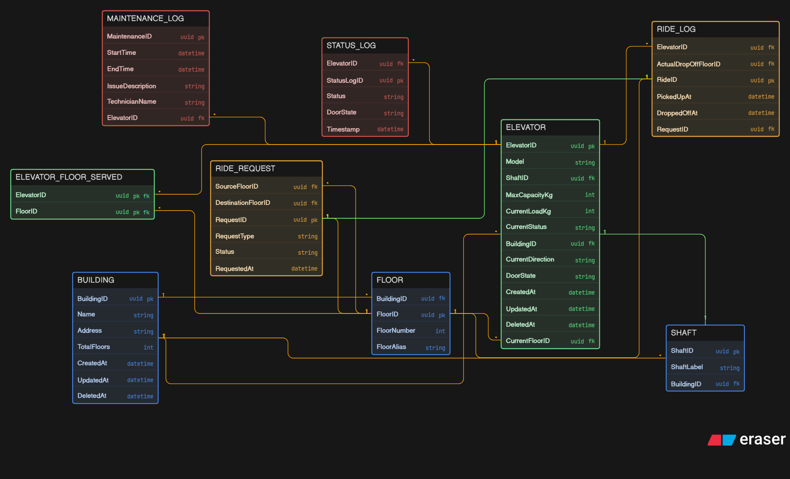

## What i Added (The Enterprise Upgrades)

To elevate the system from a basic concept to a production-ready, highly scalable architecture, i introduced several key structural improvements:

* **Universally Unique Identifiers (UUIDs):** i replaced standard auto-incrementing integers with UUIDs for all Primary and Foreign keys. This is critical for distributed IoT systems, ensuring that if an elevator goes offline and syncs data later, its IDs will never collide with another elevator's data.
* **Real-Time State Tracking:** To make instant routing decisions without querying heavy historical logs, i added live-state columns directly to the `ELEVATOR` table: `CurrentFloorID`, `CurrentDirection`, `DoorState`, and `CurrentLoadKg`.
* **Strict Data Typing:** i changed fields like `CurrentLoadKg` from text (`VARCHAR`) to integers (`INT`). This allows the backend to perform instant mathematical safety checks (e.g., evaluating if `CurrentLoadKg > MaxCapacityKg` before allowing doors to close).
* **Soft Deletes & Auditing:** i added `CreatedAt`, `UpdatedAt`, and `DeletedAt` timestamps to core configuration tables. If an elevator is physically removed from a building, the record is "soft deleted." This ensures years of valuable analytics in the ride and maintenance logs are not accidentally wiped out by a cascading database delete.
* **Granular Ride Analytics:** i added `RequestType` to differentiate betien someone pressing a button in the hallway versus inside the car. i also added `ActualDropOffFloorID` to the `RIDE_LOG` to track reality (where the passenger actually exited) versus their original intent.

---

## How the System Works

The schema is divided into three distinct operational layers that work together to manage the lifecycle of an elevator system.

### 1. Infrastructure & Configuration (The Setup)
This layer defines the physical reality of the building.

* A `BUILDING` contains multiple `FLOOR`s and `SHAFT`s.
* An `ELEVATOR` is installed inside a specific shaft.
* Because some elevators act as "express" lifts and skip certain floors, the `ELEVATOR_FLOOR_SERVED` junction table maps exactly which floors a specific elevator is alloid to visit, creating programmable "zones."

### 2. Live Operations (The Request Pipeline)
This is the high-speed transactional layer handling real-time movement.

* When a user presses a button, a `RIDE_REQUEST` is instantly generated, logging their starting floor and the time.
* The system's routing algorithm looks at the `ELEVATOR` table to check the `CurrentStatus`, `CurrentFloorID`, and `CurrentLoadKg` of all nearby lifts to decide which one is best suited for the job.
* Once the trip is finished, the system generates a `RIDE_LOG`. This creates a permanent, completed record linking the specific request, the elevator that handled it, and the exact timestamps of pickup and drop-off.

### 3. History & Analytics (The Append-Only Logs)
This layer guarantees that historical data is never overwritten by live operational updates.

* Instead of just changing an elevator's status to "broken," the system writes a permanent record to the `MAINTENANCE_LOG`, tracking who fixed it, when, and what the issue was.
* The `STATUS_LOG` acts as a heartbeat monitor, quietly recording every single state change (doors opening, moving up, moving down) over time.

---

## Database Schema (ER Diagram)

The following Diagram-as-Code defines the complete structure, relationships, and layout for the platform's database.

```text
// Entities and Attributes
BUILDING [color: blue] {
  BuildingID uuid pk
  Name string
  Address string
  TotalFloors int
  CreatedAt datetime
  UpdatedAt datetime
  DeletedAt datetime
}

FLOOR [color: blue] {
  FloorID uuid pk
  BuildingID uuid fk
  FloorNumber int
  FloorAlias string
}

SHAFT [color: blue] {
  ShaftID uuid pk
  BuildingID uuid fk
  ShaftLabel string
}

ELEVATOR [color: Green] {
  ElevatorID uuid pk
  BuildingID uuid fk
  ShaftID uuid fk
  CurrentFloorID uuid fk
  Model string
  MaxCapacityKg int
  CurrentLoadKg int
  CurrentStatus string
  CurrentDirection string
  DoorState string
  CreatedAt datetime
  UpdatedAt datetime
  DeletedAt datetime
}

ELEVATOR_FLOOR_SERVED [color: green] {
  ElevatorID uuid pk fk
  FloorID uuid pk fk
}

RIDE_REQUEST [color: orange] {
  RequestID uuid pk
  SourceFloorID uuid fk
  DestinationFloorID uuid fk
  RequestType string 
  Status string
  RequestedAt datetime
}

RIDE_LOG [color: orange] {
  RideID uuid pk
  RequestID uuid fk
  ElevatorID uuid fk
  ActualDropOffFloorID uuid fk
  PickedUpAt datetime
  DroppedOffAt datetime
}

MAINTENANCE_LOG [color: red] {
  MaintenanceID uuid pk
  ElevatorID uuid fk
  StartTime datetime
  EndTime datetime
  IssueDescription string
  TechnicianName string
}

STATUS_LOG [color: red] {
  StatusLogID uuid pk
  ElevatorID uuid fk
  Status string
  DoorState string
  Timestamp datetime
}

// Relationships
FLOOR.BuildingID > BUILDING.BuildingID: [color: orange]
SHAFT.BuildingID > BUILDING.BuildingID: [color: orange]
ELEVATOR.BuildingID > BUILDING.BuildingID: [color: orange]
ELEVATOR.ShaftID - SHAFT.ShaftID: [color: green]
ELEVATOR_FLOOR_SERVED.ElevatorID > ELEVATOR.ElevatorID: [color: orange]
ELEVATOR_FLOOR_SERVED.FloorID > FLOOR.FloorID: [color: orange]
ELEVATOR.CurrentFloorID > FLOOR.FloorID: [color: orange]
RIDE_REQUEST.SourceFloorID > FLOOR.FloorID: [color: orange]
RIDE_REQUEST.DestinationFloorID > FLOOR.FloorID: [color: orange]
RIDE_LOG.RequestID - RIDE_REQUEST.RequestID: [color: green]
RIDE_LOG.ElevatorID > ELEVATOR.ElevatorID: [color: orange]
RIDE_LOG.ActualDropOffFloorID > FLOOR.FloorID: [color: orange]
MAINTENANCE_LOG.ElevatorID > ELEVATOR.ElevatorID: [color: orange]
STATUS_LOG.ElevatorID > ELEVATOR.ElevatorID: [color: orange]
```